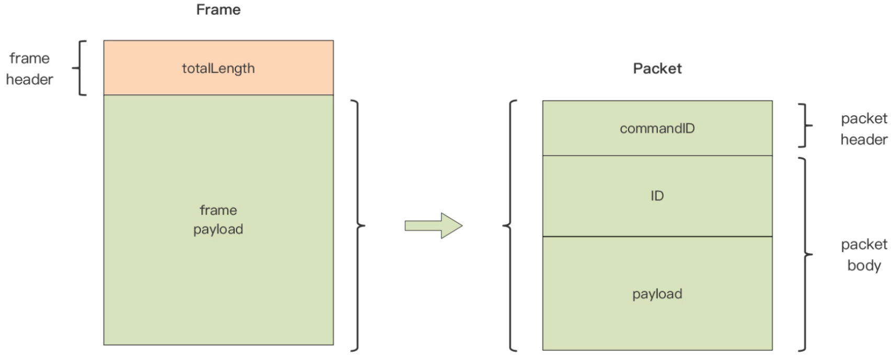

# 1. 概述
目的：实现一个基于TCP的自定义应用层协议的通信服务端。
# 2. 协议设计
## 2.1 请求消息

## 2.2 响应消息

commandID 有如下几种类型：
- 连接请求包（值为0x01）
- 消息请求包（值为0x02）
- 连接响应包（值为0x81）
- 消息响应包（值为0x82）
# 3. 协议抽象
将整个包抽象为一个 Frame, 包含 totalLen 和 Packet 两部分。
Packet 包含 commandID、ID 和 Body。
如下图所示，

# 4. 测试客户端
```go
package main

import (
	"fmt"
	"net"
	"sync"
	"time"

	"go-toy/tcp-server/frame"
	"go-toy/tcp-server/packet"

	"github.com/lucasepe/codename"
)

func main() {
	var wg sync.WaitGroup
	var num int = 5

	wg.Add(num)

	for i := 0; i < num; i++ {
		go func(i int) {
			defer wg.Done()
			startClient(i)
		}(i + 1)
	}
	wg.Wait()
}

// startClient 启动客户端
// 连接服务器，生成提交消息，编码为帧，写入连接，从连接中读取确认帧，解码为提交确认消息，打印确认结果
func startClient(i int) {
	quit := make(chan struct{})
	done := make(chan struct{})
	conn, err := net.Dial("tcp", ":8888")
	if err != nil {
		fmt.Println("dial error:", err)
		return
	}
	defer conn.Close()
	fmt.Printf("[client %d]: dial ok", i)

	// 生成payload
	rng, err := codename.DefaultRNG()
	if err != nil {
		panic(err)
	}

	frameCodec := frame.NewMyFrameCodec()
	var counter int

	go func() {
		// handle ack
		for {
			select {
			case <-quit:
				done <- struct{}{}
				return
			default:
			}

			conn.SetReadDeadline(time.Now().Add(time.Second * 5))
			ackFramePayLoad, err := frameCodec.Decode(conn)
			if err != nil {
				if e, ok := err.(net.Error); ok {
					if e.Timeout() {
						continue
					}
				}
				panic(err)
			}

			p, err := packet.Decode(ackFramePayLoad)
			submitAck, ok := p.(*packet.SubmitAck)
			if !ok {
				panic("not submitack")
			}
			fmt.Printf("[client %d]: the result of submit ack[%s] is %d\n", i, submitAck.ID, submitAck.Result)
		}
	}()

	for {
		// send submit
		counter++
		id := fmt.Sprintf("%08d", counter) // 8 byte string
		payload := codename.Generate(rng, 4)
		s := &packet.Submit{
			ID:      id,
			Payload: []byte(payload),
		}

		framePayload, err := packet.Encode(s)
		if err != nil {
			panic(err)
		}

		fmt.Printf("[client %d]: send submit id = %s, payload=%s, frame length = %d\n",
			i, s.ID, s.Payload, len(framePayload)+4)

		err = frameCodec.Encode(conn, framePayload)
		if err != nil {
			panic(err)
		}

		time.Sleep(1 * time.Second)
		if counter >= 10 {
			quit <- struct{}{}
			<-done
			fmt.Printf("[client %d]: exit ok\n", i)
			return
		}
	}
}
```